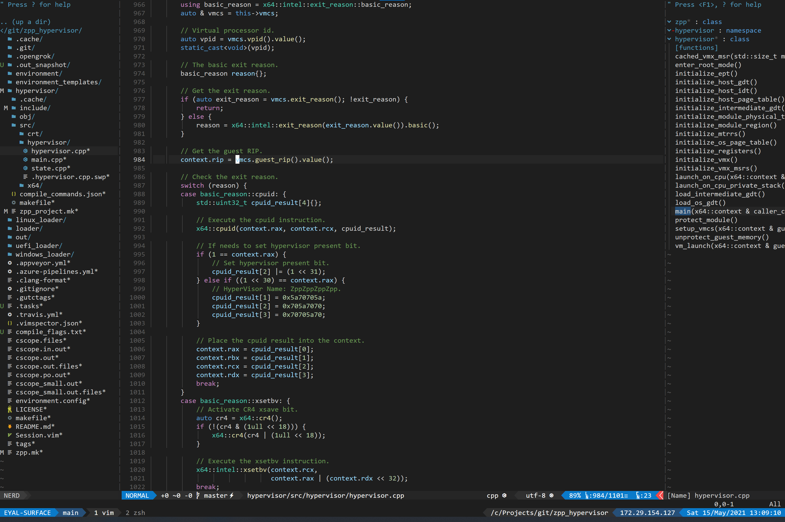

vimrc
=====

Installation
------------
This is the only thing you need to do to install, it will replace any existing vimrc and perform necessary installations:
```sh
$ sudo ./install.sh
```

Highlights
----------
* Supports easy installation on a clean machine, with many useful commands (see commands below)
* Supports completion wherever possible, mainly focused around C++ code completion using clangd.
* Nice color scheme.
* Comes with a good set of plugins.
* More surprises are waiting for those who read the vimrc.
* Debugging support.

Screenshots
-----------




Useful Commands
---------------
* Commands to generate source index, run in the root directory - you need to run both of them.
```
<leader>zp - Generate/update C++ databases - optimized to work for large repositories.
<leader>zk - Generate/update opengrok database for common source files (see ZGenerateOpengrok)
```

* Commands to search for files:
```
<C-p> - Search for a file name.
```

* Commands to search for code:
```
<leader>zo - Search opengrok for word under cursor.
<leader><leader>zo - Search opengrok for arbitrary input text.

<leader>cs - Search cscope for word under cursor.
<leader><leader>cs - Search cscope for arbitrary input text.

gd - Go to definition (current word).
```

* Commands to view directory tree and source code function pane on each side of the screen:
```
<C-l> - Turn on / off the directory tree and source code function panes.
```

* Terminal commands:
```
<leader>zb - Open small terminal window below.
<leader>zB - Open large terminal window below.
```

* Debugging commands:
```
<leader>dl - Configure debugging configuration - requires an open cpp or python file.
<leader>dd - Start debugging - search vimrc for "vimspector" for additional mapping.
<leader>dc - Continue debuggee
<leader>ds - Stop debugging
<leader>dr - Restart debugging
<leader>dp - Pause debugging
<leader>db / F9 - Breakpoint
<leader>bf - Add function breakpoint
<leader>dn / F10 - Step Over
<leader>di / F11 - Step Into
<leader>do - Step Out
<leader>dq - Quit debugger
<leader>de - Use within command window, a shortcut to immediately type '-exec '.
```

* Undo tree commands:
```
<leader>zu - Toggle undo tree.
```

* File manager commands:
```
<leader>fe - Open file manager, for editting.
<leader>fs - Open file manager, for split.
```

* Trailing whitespaces:
```
<leader>zw - Strip trailing whitespaces.
<leader>zW - Toggle trailing whitespace visibility on/off.
```

* Mouse:
```
<leader>zm - Toggle mouse on/off.
```

* Resizing:
```
L - Modify width + 1
H - Modify width - 1
<C-w>= - Modify height + 1
<C-w>- - Modify height - 1
```

* Zoom:
```
<C-w>z - Zoom in window
```

* Paste mode:
```
<F5> - Toggle paste mode.
```

* Git:
```
<leader>M / <leader>gm - Vimagit staging plugin
<leader>gb - View blame
```

* Comment in/out:
```
gc - Comment in/out selected code.
```

* Jump within file:
```
s{char1}{char2} - Jump to a location with the following two characters {char1}{char2}.
; - Move forward to next option.
```

* Close current window:
```
<C-w>w - Close current window.
```

* View / select from open buffers:
```
<leader>b - View / select from open buffers.
```

* Toggle on/off term gui colors persistently, by default it is on but may cause problems:
```
<leader>tg - Toggle on/off term gui colors persistently.
```

* Generate compile commands json:
```
<leader>zj - Type in the make command and it will generate the compile commands.
```
