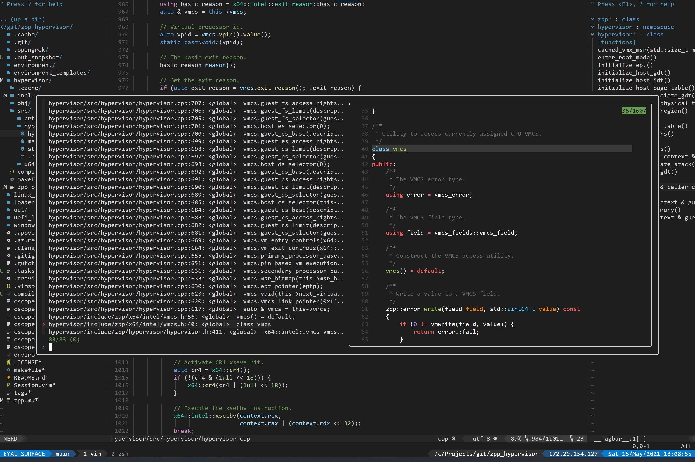
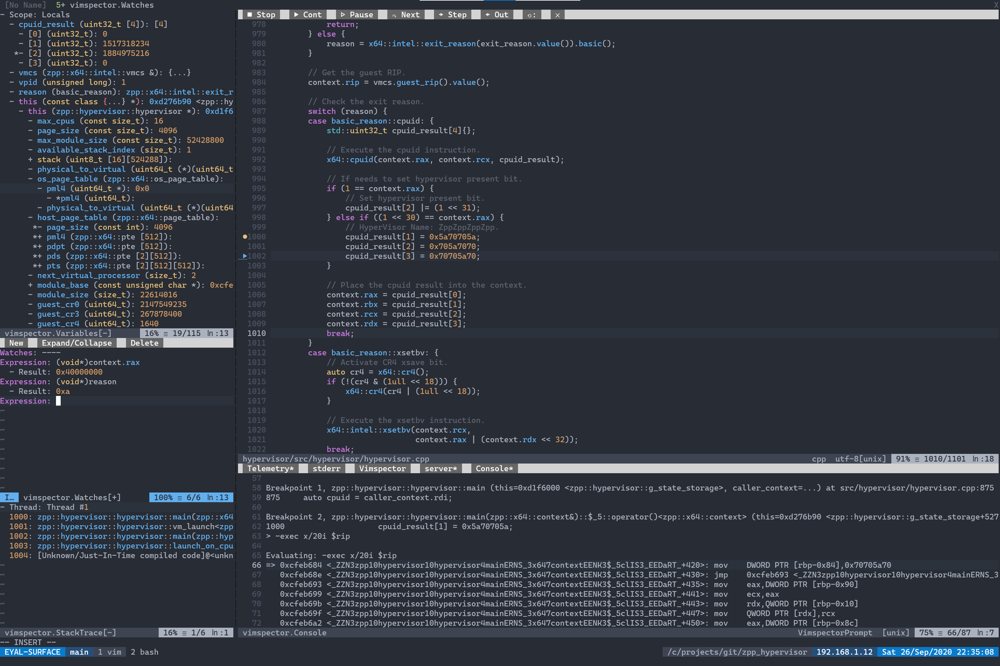
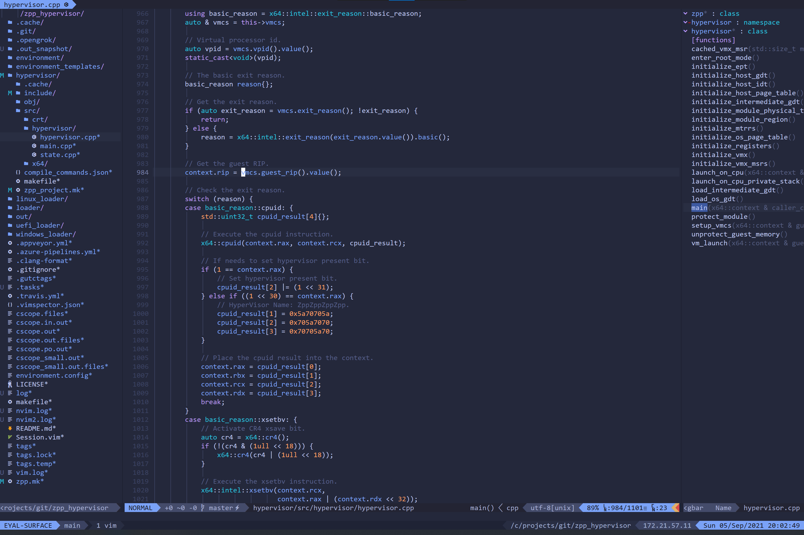

vimrc
=====
[](https://dev.azure.com/eyalz800/vimrc/_build/latest?definitionId=6&branchName=master)

Installation
------------
This is the only thing you need to do to install, it will replace any existing vimrc and perform necessary installations:
```sh
$ ./install.sh
```

Highlights
----------
* Supports easy installation on a clean machine, with many useful commands (see commands below)
* Supports completion wherever possible, mainly focused around C++ code completion using clangd.
* Nice color scheme.
* Comes with a good set of plugins.
* More surprises are waiting for those who read the vimrc.
* Debugging support.

Screenshots
-----------







Useful Commands
---------------
* Commands to generate source index, run in the root directory - you need to run both of them.
```
<leader>zz - Generate/update C++ and opengrok database.

<leader>zp - Generate/update C++ databases - optimized to work for large repositories.
<leader>zk - Generate/update opengrok database for common source files (see ZGenerateOpengrok)
```

* Commands to generate tags (this is optional and usually unnecessary):
```
<leader>zt - Generate tags for C/C++.
<leader>zT - Generate tags for everything.
```

* Commands to search for files:
```
<C-p> - Search for a file name.
<C-]> / cz - Search for a file name, filter common source files as determined in `.vimrc`.
```

* Commands to search for code:
```
<leader>zo - Search opengrok for word under cursor.
<leader><leader>zo - Search opengrok for arbitrary input text.

<leader>cs - Search cscope for word under cursor.
<leader><leader>cs - Search cscope for arbitrary input text.

gd - Go to definition (fast) (current word).
<leader>zg - Go to definition (current word), first use lsp, then fallback to cscope/opengrok.

gz / <leader>zd - Go to definition (current word) using cscope/opengrok.
<leader><leader>zd - Go to definition - search arbitrary input text using cscope/opengrok.

<leader>zD - Go to declaration (current word) using cscope/opengrok.
<leader><leader>zD - Go to declaration - search arbitrary input text using cscope/opengrok.

<C-n> - Search tags.

z/ or z? - Fuzzy search inside file.

// - Fuzzy search the current file lines.

<C-g> - Search recursively using rg.
```

* Toggle between source and header file:
```
go - Toggle between source and header file.
```

* Commands to view directory tree and source code function pane on each side of the screen:
```
<leader>ll - Turn on / off the directory tree and source code function panes using nerd tree and tagbar.
<leader>lc - Like previous but shows current file on directory tree.
<leader>nf - Show current file in the directory tree using nerd tree.
<leader>nd - Show current directory in nerd tree.
<leader>nt - Toggle nerd tree on/off.
<leader>tt - Toggle tagbar on/off.

cf - Print current file path, if nerd tree is open, show it there as well.
cq - Print current directory path, if nerd tree is open, show it there as well.
```

* Terminal commands:
```
<leader>zb - Open a small terminal window below.
<leader>zv - Open a terminal window on a vertical split.
<leader>zs - Open a terminal window below.
<C-w>m - Toggle terminal scrolling (enabled by default)
<C-w>n - Terminal normal mode.
a - Exit terminal normal mode.
```

* Debugging commands:
```
<leader>dl - Configure debugging configuration - requires an open cpp or python file.
<leader>dd - Start debugging - search vimrc for "vimspector" for additional mapping.
<leader>dc / F5 - Continue debuggee
<leader>dr / S-F5 - Restart debugging
<leader>dp / F6 - Pause debugging
<leader>ds / S-F6 - Stop debugging
<leader>db / F9 - Breakpoint
<leader><leader>db / S-F9 - Conditional breakpoint
<leader>df / <leader>F9 - Add function breakpoint
<leader>dB / <leader><leader>F9 - Clear all breakpoints
<leader>dn / F10 - Step over
<leader>di / S-F10 / F11 - Step into
<leader>do / S-F11 - Step out
<leader>dq - Quit debugger
x - Execute remote command - use within command window, a shortcut to immediately type '-exec '.
```

* Undo tree commands:
```
<leader>zu - Toggle undo tree.
```

* File manager commands:
```
<leader>fe - Open file manager, for editting.
<leader>fs - Open file manager, for split.
```

* Trailing whitespaces:
```
<leader>zw - Strip trailing whitespaces.
<leader>zW - Toggle trailing whitespace visibility on/off.
```

* Mouse:
```
<leader>zm - Toggle mouse on/off.
```

* Resizing:
```
L - Modify width + 1
H - Modify width - 1
<C-w>= - Modify height + 1
<C-w>- - Modify height - 1
```

* Zoom:
```
<C-w>z - Zoom in window
```

* Paste mode:
```
<F8> - Toggle paste mode.
```

* Git:
```
<leader>gm - Vimagit staging plugin.
<leader>gb - View blame.
<leader>gc - View commits.
<leader>gf - View git files.
<leader>gl - Lazy git staging plugin.
    - up/down to move between files.
    - space to stage/unstage.
    - enter to go into staging each lines individually.
    - c to commit.
    - Shift-A to commit ammend.
    - Shift-P to push.
    - ? for help.
<leader>gL - Lazy git launch in current dir instead of file dir.
<leader>gt - Open tig in file directory.
<leader>gT - Open tig in current directory.
```

* Comment in/out:
```
gc - Comment in/out selected code.
```

* Jump within file:
```
s{char1}{char2} - Jump to a location with the following two characters {char1}{char2}.
```

* Close current window / buffer:
```
<C-w>w - Close current window.
<C-w>d - Close current buffer.
```

* View / select from open buffers:
```
<C-\> - View / select from open buffers.
```

* Toggle on/off term gui colors persistently, by default it is on but may cause problems:
```
<leader>tg - Toggle on/off term gui colors persistently.
```

* Generate compile commands json:
```
<leader>zj - Type in the make command and it will generate the compile commands.
```

* Toggle LSP server, switch between coc and vim-lsp:
```
:call ZToggleLspPersistent() - Switch between coc and vim-lsp.
```

* Multiple Cursors:
```
<leader>ms - Find word under cursor.
    n - next word.
    q - skip word.
<C-j> / <C-Down> - Add cursor below.
<C-k> / <C-Up> - Add cursor above.
<leader>mA - Find all words.
<leader>ma - Align all cursors.
<leader>mm - Add cursor at poition.
m/ - Regex search.
```

* Files Cache Settings:
```
<leader>zh - Generate source files cache (if does not exist, generated by <leader>zp)
<leader>zH - Generate files cache (all files)

Toggle use of file cache - note - if either local or global is on, it will use the cache:
<leader>fh - Toggle use of file cache locally.
<leader>fH - Toggle use of file cache globally.
```

* Tag stack - go back/forward in the tag stack:
```
<leader>o - Pop tag stack.
<leader>i - Go to newer tag.
```

* Save / Restore Session:
```
Use the ':Obsession' command to start recording to a session file automatically
and invoke 'vim -S' to restore the session at the next time.
```

* Setting persistant color:
```
:ZColor 'onedark' - using onedark.
:ZColor 'codedark' - using codedark.
:ZColor 'nord' - using nord.
:ZColor 'tokyonight' - using tokyonight.
<leader>tb - transparent background.
```

* Edit in hex dump mode:
```
// Before the file is open:
vim -b [binary_file]
vimdiff -b [binary_file_1] [binary_file_2]

// After the file is open:
<leader>bf - Switch to/from binary file editting.
```

* Disassembly view (objdump):
```
<leader>dv - Switch to/from disassembly view of the file.
```

* Directory switching:
```
cd - Change directory to current file directory.
cp - Change directory to project root of current file.
cr - Change directory back to the root - the folder where vim was opened.
ca - Change directory to arbitrary folder by folder/file.
cu - Change directory to upper (parent) directory.
```

* Clipboard:
```
<C-c> - Copy selected text to clipboard.
<C-x> - Cut selected text into clipboard.
<C-v> - Paste from unnamed register.
:ZToggleOscCopy - persistently toggle osc copy (default on)
:ZToggleForceXServer - persistently force / no force connect to x server on ssh (default off).
```

* Text selection:
```
<C-a> - Select all text.
```

* Increment and decrement numbers:
```
<leader>= - Increment number.
<leader>- - Decrement number.
```

* File operations:
```
<C-s> - Save file.
```

* Toggle seamless tmux/vim navigation:
```
<C-w>t - Toggle seamless tmux/vim navigation (default enabled if inside tmux).
```

* Toggle text wrap:
```
- - Toggle text wrap.
```

* Sidways scrolling:
```
<C-l> - scroll right.
<C-h> - scroll left.
```

* Build and run:
```
<F7> - Build project.
<S-F7> - Clean project.
<C-F5> - Run project.
<C-F7> - Reconfigure build.
```

* Quickfix window:
```
<C-w>p - Open quickfix.
<C-w>q - Close quickfix.
```

* Toggle fold / unfold:
```
<leader>u - Toggle fold / unfold.
```

* Toggle Terminus:
Note: sometimes there are issues of strange output when using terminus with fzf and nested terminal windows.
```
ZToggleTerminus - Toggles terminus on/off - requires restarting vim.
```

* Toggle Powerline & Dev Icons:
```
ZTogglePowerline - Toggles the use of powerline (on by default).
ZToggleDevIcons - Toggles the use of dev icons (on by default).
```

* Toggle Line Indent View:
```
<leader>zi / ZToggleIndentLines - Toggle view of line indentation (on by default)
```

* Switch current word case style:
```
<leader>crs - Convert to snake_case.
<leader>crm - Convert to MixedCase.
<leader>crc - Convert to camelCase.
<leader>cru - Convert to UPPER_CASE.
<leader>cr- - Convert to dash-case.
<leader>cr<space> - Convert to space case.
<leader>cr. - Convert to dot.case.
<leader>crt - Convert to Title Case.
```

* Snippet complete:
```
<C-d> - Expand snippet in insert mode.
<C-r> - Replace-Expand snippet in visual mode.
```

* Moving between buffer tabs:
```
<f1> - Move to previous buffer.
<f2> - Move to next buffer.
<leader>1...9 - Select buffer #1..#9
```

* Pasting from history:
```
<space>h - Paste from yank history.
```

* Focus writing mode:
```
<C-w>f - Focus writing mode using goyo plugin.
```
